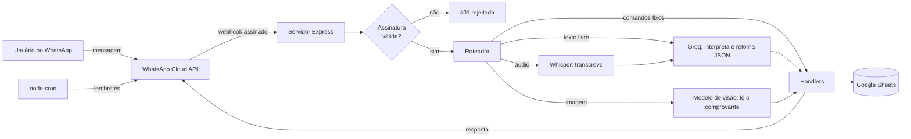

# 💸 Bot Financeiro

**Controle de gastos pelo WhatsApp, com IA e Google Sheets.**
Mande um texto, um áudio ou a foto de um comprovante. O bot entende, categoriza e registra na sua planilha.
---

## Como funciona na prática

```text
Você:  Gastei 150 no mercado
Bot:   ✅ Registro Confirmado
       💸 Mercado
       💵 Valor: R$ 150.00
       📂 Categoria: Alimentação
       📅 Data: 09/10/2026

Você:  Gastei 250 com mecânico
Bot:   🤔 Categoria inexistente para "Mecânico".
       Deseja criar Serviços de Veículo?   [✅ Sim, Criar]  [❌ Não]

Você:  🎤 (áudio) "Recebi quinhentos de pix"
Bot:   ✅ Registro Confirmado — 💰 Pix — R$ 500.00 (Entrada)

Você:  Gerar gráfico
Bot:   📊 Análise Visual do Mês   (gráfico de pizza por categoria)
```

> Exemplo ilustrativo das mensagens do bot. Adicione aqui prints reais do seu WhatsApp e da planilha.

## Destaques

- **Linguagem natural:** o usuário escreve como fala ("paguei cinquenta na farmácia"). A IA converte a frase em um JSON estruturado, e o código valida antes de salvar.
- **Multimodal:** texto, áudio (transcrição com Whisper) e foto de nota ou comprovante (visão computacional).
- **Categorias que se adaptam:** se nada encaixa, o bot propõe uma categoria nova e pergunta por botão interativo.
- **Gastos fixos:** cadastre uma vez e lance tudo no mês com um comando, sem duplicar.
- **Metas e lembretes opcionais:** alerta de limite por categoria e lembrete diário às 09:40 (dias úteis).
- **Multiusuário com dados isolados:** cada número de WhatsApp tem a própria aba, os próprios fixos e as próprias metas.
- **Sem banco para administrar:** os dados ficam numa planilha que o próprio usuário pode abrir e conferir.

## Arquitetura



**Fluxo de uma mensagem:** o webhook valida a assinatura, identifica o tipo de mídia e passa o conteúdo para a IA. A IA devolve uma ação (`REGISTRAR`, `EDITAR`, `EXCLUIR`, `CADASTRAR_FIXO`, `CONSULTAR`, `CONVERSAR`...). O roteador chama o handler correspondente, que valida os dados, grava na planilha e responde ao usuário.

## Decisões técnicas

| Decisão | Motivo |
| --- | --- |
| **IA só interpreta, o código decide** | A resposta da IA passa por validação (valor, tipo, campos obrigatórios) antes de qualquer escrita. |
| **Assinatura HMAC no webhook** | Só requisições da Meta são aceitas (`X-Hub-Signature-256`, comparação em tempo constante). |
| **Gravação `raw` no Sheets** | Texto digitado pelo usuário nunca é interpretado como fórmula. |
| **Dados por usuário** | Fixos, metas e categorias são filtrados pelo número, e um usuário nunca vê o dado do outro. |
| **Modelos configuráveis por `.env`** | Provedores de IA descontinuam modelos com frequência, e trocar não exige alterar código. |
| **Falha rápida na inicialização** | O servidor não sobe com configuração incompleta e informa o que falta. |
| **Google Sheets como armazenamento** | Zero infraestrutura e transparência para o usuário. É adequado para uso pessoal ou de poucos usuários. |

## Estrutura do projeto

```text
server.js                      Webhook, validação de assinatura, roteamento e cron
src/
  config/mensagens.js          Menu de ajuda
  handlers/processadores.js    Ações: registrar, editar, excluir, fixos, consulta
  services/
    ai.js                      Groq: interpretação, transcrição e visão
    sheets.js                  Leitura e escrita no Google Sheets
    whatsapp.js                Envio de mensagens pela Cloud API
  utils.js                     Datas, validação, parse de JSON e formatação
```

## Como rodar

### Pré-requisitos

- Node.js 18 ou superior
- App do WhatsApp Business na [Meta for Developers](https://developers.facebook.com) (Cloud API)
- Chave de API da [Groq](https://console.groq.com)
- Conta de serviço do Google Cloud com a Google Sheets API ativada
- URL pública com HTTPS para o webhook (em desenvolvimento, use um túnel como o ngrok)

### 1. Instalar

```bash
git clone <url-do-repositorio>
cd bot-financeiro
npm install
```

### 2. Variáveis de ambiente

Crie um `.env` na raiz:

```env
PORT=3000

# Meta / WhatsApp
MY_TOKEN=token-de-verificacao-que-voce-escolhe
APP_SECRET=app-secret-do-painel-da-meta
WHATSAPP_TOKEN=token-de-acesso-da-cloud-api
PHONE_NUMBER_ID=id-do-numero-de-telefone

# Groq
GROQ_API_KEY=sua-chave
GROQ_TEXT_MODEL=llama-3.3-70b-versatile
GROQ_VISION_MODEL=qwen/qwen3.8-27b

# Google Sheets
SHEET_ID=id-da-planilha
```

| Variável | Obrigatória | Função |
| --- | --- | --- |
| `MY_TOKEN` | Sim | Token digitado na Meta ao cadastrar o webhook |
| `APP_SECRET` | Sim | Valida a assinatura das requisições (App → Configurações → Básico) |
| `WHATSAPP_TOKEN` | Sim | Envio de mensagens e download de mídia |
| `PHONE_NUMBER_ID` | Sim | Número do WhatsApp que envia as mensagens |
| `GROQ_API_KEY` | Sim | Acesso à Groq |
| `SHEET_ID` | Sim | ID da planilha (o trecho do meio da URL) |
| `GROQ_TEXT_MODEL` | Não | Modelo de texto (padrão: `llama-3.3-70b-versatile`) |
| `GROQ_VISION_MODEL` | Não | Modelo de visão (padrão: `qwen/qwen3.8-27b`) |
| `PORT` | Não | Porta do servidor (padrão: `3000`) |

> Os modelos da Groq mudam com frequência. Para ver os que estão ativos na sua conta:
> `curl -s https://api.groq.com/openai/v1/models -H "Authorization: Bearer $GROQ_API_KEY"`
> Confira também se o modelo de visão escolhido aceita imagem.

### 3. Google Sheets

1. No Google Cloud, crie uma **conta de serviço**, ative a **Google Sheets API** e baixe a chave JSON.
2. Salve como `google.json` na raiz. O arquivo está no `.gitignore`, **nunca o envie ao repositório**.
3. Crie uma planilha vazia e **compartilhe com o `client_email`** da conta de serviço como editor.
4. Copie o ID da planilha para `SHEET_ID`.

O bot cria as abas automaticamente:

| Aba | Colunas |
| --- | --- |
| *Número do usuário* (uma por pessoa) | `Data`, `Categoria`, `Item/Descrição`, `Valor`, `Tipo` |
| `Usuarios` | `Numero`, `Ativo`, `Alertas_Meta`, `Data_Inscricao` |
| `Metas` | `Numero`, `Categoria`, `Limite`, `Cor` |
| `Fixos` | `Numero`, `Item`, `Valor`, `Categoria`, `Ativo` |

### 4. Webhook na Meta

1. Em **WhatsApp → Configuração**, cadastre `https://seu-dominio/webhook`.
2. Use o valor de `MY_TOKEN` como token de verificação.
3. Assine o campo **messages**.

### 5. Executar

```bash
npm start
```

Health check: `GET /health`.

## Comandos

| Você envia | O bot faz |
| --- | --- |
| "Gastei 150 no mercado" | Registra uma saída |
| "Recebi 500 de pix" | Registra uma entrada |
| Áudio ou foto do comprovante | Transcreve ou lê e registra |
| "Mudar valor do Uber para 20" | Edita o último gasto com esse nome |
| "Apagar último gasto" | Exclui o último lançamento |
| "Cadastrar fixo Aluguel 1200" | Salva uma conta fixa |
| "Lançar fixos" | Lança os fixos do mês (uma vez por mês) |
| "Resumo do mês" / "Gerar gráfico" | Análise textual ou gráfico de pizza |
| "Ativar" / "Desativar lembretes" | Lembrete diário às 09:40, seg a sex |
| "Ativar" / "Desativar alertas" | Aviso ao ultrapassar o limite de uma categoria |
| "Ajuda" | Mostra o menu |

## Segurança

- Webhook protegido por assinatura HMAC SHA-256.
- Escrita em modo `raw`: sem injeção de fórmulas na planilha.
- Segredos fora do repositório (`.env` e `google.json` no `.gitignore`).
- Isolamento de dados por número de telefone.

## Roadmap

Próximos passos que pretendo implementar:

- [ ] Responder o webhook imediatamente e processar em fila por usuário, com deduplicação por `message.id`.
- [ ] Persistir lançamentos pendentes (hoje ficam em memória).
- [ ] Usar templates aprovados da Meta nos lembretes (exigência da Cloud API fora da janela de 24 h).
- [ ] Calcular totais e resumos no código e usar a IA só para redigir a resposta.
- [ ] Testes automatizados (parser de JSON, validação, roteador de comandos e verificação de assinatura).
- [ ] Migrar de Google Sheets para um banco relacional quando o volume de usuários crescer.

## Autor

**Gustavo Anselmo**, estudante de Engenharia de Software.
[LinkedIn]([https://linkedin.com/in/seu-perfil](https://www.linkedin.com/in/gustavo-anselmo-613779225/)) · [GitHub]([https://github.com/seu-usuario](https://github.com/Gustavo-Anselmo))

